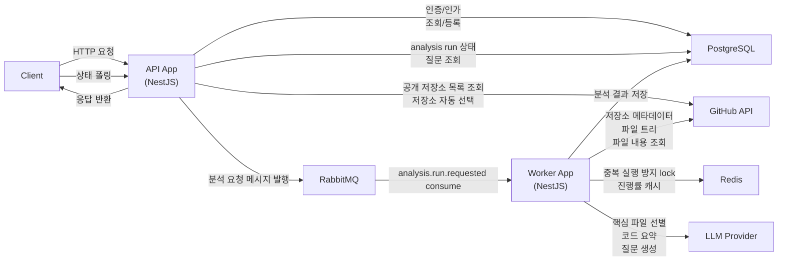

# code-ray-server

## Backend Architecture

`code-ray-server`는 **API 서버**와 **Worker 서버**를 분리한 비동기 분석 시스템입니다.

- API 서버는 사용자 요청을 받고 분석 작업을 큐에 등록합니다.
- Worker 서버는 큐에 쌓인 작업을 가져와 GitHub 코드 수집, LLM 분석, 질문 생성을 수행합니다.
- PostgreSQL은 결과와 상태를 저장하고, Redis는 캐시와 Lock을 담당합니다.

## System Flow



---

## Components

| Component | Role | Why It Exists |
| --- | --- | --- |
| **API App** | HTTP 요청 처리 | 클라이언트 요청을 받고 인증, 인가, 분석 요청 등록을 담당합니다. |
| **Worker App** | 분석 파이프라인 실행 | 시간이 오래 걸리는 GitHub 조회, LLM 호출, 결과 저장을 백그라운드에서 처리합니다. |
| **PostgreSQL** | 영속 데이터 저장 | 사용자, 지원자, 분석 상태, 분석 결과, 생성된 질문을 저장합니다. |
| **RabbitMQ** | 작업 큐 | API와 Worker를 분리하고 분석 요청을 비동기로 전달합니다. |
| **Redis** | 캐시 / Lock | GitHub 응답 캐싱, 동일 저장소 중복 분석 방지, 진행 상태 임시 캐시에 사용합니다. |
| **GitHub API** | 저장소 정보와 파일 조회 | API App은 공개 저장소 목록을 조회하고, Worker App은 파일 트리와 핵심 파일 원문을 조회합니다. |
| **LLM** | 코드 분석 / 질문 생성 | 코드 요약, 핵심 파일 선별, 면접 질문 생성을 수행합니다. |

---

## Monorepo Structure

```text
apps/
├── api
│   └── HTTP 요청, 인증/인가, 큐 발행
│
└── worker
    └── RabbitMQ 메시지 소비, 분석 파이프라인 실행

libs/
├── core
│   └── Enum, 공통 타입, 상수
│
├── database
│   └── TypeORM 설정, Entity, Migration
│
├── integrations
│   └── GitHub, LLM, RabbitMQ, Redis 클라이언트
│
├── contracts
│   └── API 요청/응답 타입, 큐 메시지 타입
│
└── shared
    └── 공통 유틸, 로거, 예외 처리
```

---

## Analysis Flow

```text
1. 지원자 등록
   ↓
2. 분석 요청
   ↓
3. GitHub 프로필 URL에서 owner 추출
   ↓
4. 공개 저장소 목록 조회
   ↓
5. 최근 수정된 저장소 자동 선택
   ↓
6. analysis_runs 생성
   ↓
7. RabbitMQ에 분석 작업 발행
   ↓
8. Worker가 작업 소비
   ↓
9. GitHub 파일 트리 조회
   ↓
10. LLM이 핵심 파일 선별
   ↓
11. 핵심 파일 원문 조회
   ↓
12. LLM 코드 분석
   ↓
13. LLM 면접 질문 생성
   ↓
14. 결과 저장
   ↓
15. 클라이언트가 상태/질문 조회
```

---

## Data Storage

### PostgreSQL

서비스의 기준 데이터 저장소입니다.

| Stores | Description |
| --- | --- |
| `users` | 사용자 계정 |
| `groups` | 면접 그룹 |
| `applicants` | 지원자 |
| `applicant_repositories` | 분석 대상으로 선택된 GitHub 저장소 |
| `analysis_runs` | 분석 실행 상태 |
| `repository_files` | 분석에 사용된 핵심 파일 |
| `code_analysis` | 코드 분석 결과 |
| `generated_questions` | 생성된 면접 질문 |
| `llm_messages` | LLM 요청/응답 기록 |
| `prompt_templates` | LLM 프롬프트 템플릿 |

### Redis

빠른 조회와 일시적 상태 관리에 사용합니다.

| Key Pattern | Purpose |
| --- | --- |
| `github:repo:{repoFullName}` | GitHub 저장소 정보 캐시 |
| `github:tree:{repoFullName}:{branch}` | GitHub 파일 트리 캐시 |
| `analysis:lock:{repositoryId}` | 동일 저장소 동시 분석 방지 |
| `analysis:progress:{analysisRunId}` | 분석 진행 상태 임시 캐시 |

### RabbitMQ

분석 요청을 Worker로 전달하는 작업 큐입니다.

| Queue Purpose | Description |
| --- | --- |
| Analysis request | API App이 분석 요청 메시지를 발행합니다. |
| Worker consume | Worker App이 메시지를 소비하고 분석을 실행합니다. |
| Retry / Dead-letter | 실패 메시지를 일정 횟수 재시도 처리합니다. |

---

## External Integrations

### GitHub API

지원자의 GitHub 공개 저장소를 분석하기 위해 사용합니다.

- 공개 저장소 목록 조회
- 저장소 기본 정보 조회
- 파일 트리 조회
- 핵심 파일 raw content 조회

> MVP에서는 private repository를 지원하지 않습니다.

### LLM

코드를 이해하고 면접 질문을 생성하는 분석 엔진입니다.

- 분석할 핵심 파일 선별
- 코드 구조 및 구현 방식 요약
- 기술 질문 생성
- 문화 적합성 질문 생성

LLM 응답은 structured output을 기준으로 처리하며, 파싱 실패 시 분석은 `FAILED` 상태가 됩니다.

---

## Analysis Status

분석은 `analysis_runs` 단위로 관리됩니다.

| Status | Description |
| --- | --- |
| `QUEUED` | 분석 요청이 등록됨 |
| `IN_PROGRESS` | Worker가 분석 중 |
| `COMPLETED` | 분석과 질문 생성 완료 |
| `FAILED` | 분석 실패 |

현재 단계는 `current_stage`에 기록하고, 실패 원인은 `failure_reason`에 저장합니다.

---

## Key Constraints

| Constraint | Value |
| --- | --- |
| GitHub URL | 프로필 URL만 허용 (`https://github.com/{owner}`) |
| Repository access | Public repository only |
| Repository selection | 최근 수정된 저장소 최대 `MAX_REPO_SELECTION_COUNT`개 |
| Concurrent analysis | Redis Lock으로 동일 저장소 동시 분석 방지 |
| Re-analysis | 동일 지원자/저장소 조합의 완료된 분석이 있으면 재분석 불가 |
| File size | 파일 원문 최대 100KB |
| Analysis files | 최대 `MAX_ANALYSIS_FILES`개 |
| Questions | 분석 실행당 최대 `MAX_QUESTIONS_PER_ANALYSIS_RUN`개 |

---

## Design Summary

| Layer | Responsibility |
| --- | --- |
| Client | 분석 요청 및 결과 조회 |
| API App | 인증, 인가, 요청 등록, 큐 발행 |
| RabbitMQ | 비동기 작업 전달 |
| Worker App | 분석 파이프라인 실행 |
| GitHub API | 코드 수집 |
| LLM | 코드 분석 및 질문 생성 |
| Redis | 캐시, Lock, 진행 상태 임시 캐시 |
| PostgreSQL | 상태와 결과 저장 |


